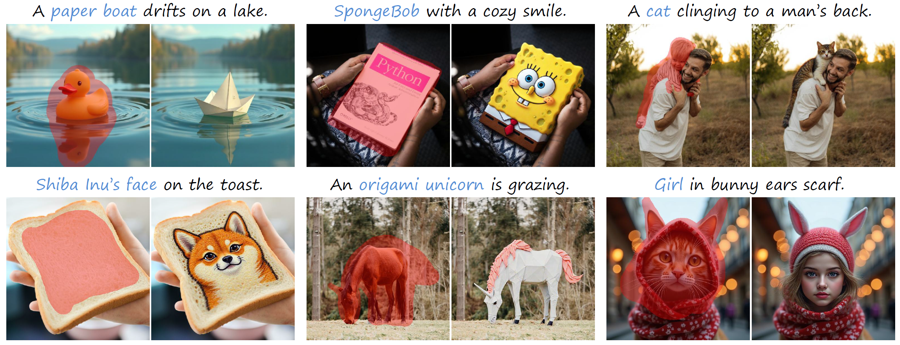

# Follow-Your-Preference

<!-- TOC -->

- [Follow-Your-Prefence](#follow-your-prefence)
    - [📝 Introduction](#-introduction)
    - [⚙️ Installation](#-installation)
        - [📦 Dataset](#-dataset)
        - [📚 Training and Inference](#-training-and-inference)
        - [⚽️ Score and Evaluation](#-score-and-evaluation)
    - [✨ Basic Usage](#-basic-usage)
        - [📂 Generate Candidates](#-generate-candidates)
        - [🏷️ Construct Preference Data](#-construct-preference-data)
        - [🏋️ Preference Alignment Training](#-preference-alignment-training)
        - [💯 Evaluation](#-evaluation)
    - [🚀 Try Our Image Inpainting Model](#-try-our-image-inpainting-model)
    - [📑 Citation](#-citation)

<!-- /TOC -->


## 📝 Introduction

This repository contains the implementation code for paper:

**Follow-Your-Preference: Towards Preference-Aligned Image Inpainting**

[*arxiv preprint 2025*](https://www.arxiv.org/pdf/2509.23082)

Yutao Shen✳, Junkun Yuan✳✉, Toru Aonishi, Hideki Nakayama, Yue Ma✉

We study image inpainting with preference alignment, giving insights into its effectiveness, scalability, challenges.




## ⚙️ Installation 

Our method has been implemented with python 3.12 and CUDA 12.1. Basically, you need to prepare **two** envs:
- One for `inference` and `training` 
- One for `scoring` and `evaluation`

### 📦 Dataset

1. Download BrushData
   - Hugging Face dataset: <https://huggingface.co/datasets/random123123/BrushData>
   - Each item in **BrushData** contains fields like:
     - `000279227.aesthetic_score` (unused)
     - `000279227.caption` (string)
     - `000279227.height` (int)
     - `000279227.image` (binary; can be read as PNG — we highly recommend saving images locally as `.png`)
     - `000279227.original_key` (unused)
     - `000279227.segmentation` (dict)
     - `000279227.url` (unused)
     - `000279227.width` (int)

2. Extract and build JSON
   - Untar all archives from **BrushData**, gather the useful fields, and create a JSON list like:
     ```
     [
       {
         "gt_image_path": "/your/path/to/000279227.png",
         "caption": "000279227.caption",
         "height": 000279227.height,
         "width": 000279227.width,
         "segmentation": 000279227.segmentation,
         "image_id": "00027_000279227"
       }
       // ...
     ]
     ```

### 📚 Training and Inference
```bash
git clone --recursive https://github.com/shenytzzz/Follow-Your-Preference.git
conda create -n train python=3.12
cd ./flux
pip install -e ".[all]"
cd ../diffusers
pip install -e ".[torch]"
pip install omegaconf transformers==4.52.0 accelerate==1.6.0 datasets==3.5.0 deepspeed==0.17.1
```

### ⚽️ Score and Evaluation
```bash
git clone --recursive https://github.com/shenytzzz/Follow-Your-Preference.git
conda create -n eval python=3.12
pip install image-reward
pip install hpsv2==1.2.0
pip install open-clip-torch==2.32.0
pip install clip
pip install torchmetrics==1.7.4
cd ./t2v_metrics
conda install pip -y
conda install ffmpeg -c conda-forge
pip install -e .
cd ..
pip install transformers==4.45.2
pip install hpsv3
pip install tensorboard
pip install wandb
```
Note
- Place `extra/bpe_simple_vocab_16e6.txt.gz` into `~/miniconda3/envs/test_eval/lib/python3.12/site-packages/hpsv2/src/open_clip/`
- We modified **score functions** in `~/miniconda3/envs/test_eval/lib/python3.12/site-packages/hpsv2/__init__.py` and `~/miniconda3/envs/test_eval/lib/python3.12/site-packages/hpsv2/img_score.py` for multi-gpu evaluation. Our modified versions are also provided under `extra/`
- Our code is built opon `diffusers 0.33.1`. Following `BrushNet`, we: 
  - Added directory `brushnet` under `diffusers/src/diffusers/pipelines/` 
  - Added file `brushnet.py` under `diffusers/src/diffusers/models/` 
  - Updated `__init__.py` accordingly. 
  - Replace the entire directory `unet` under `diffusers/src/diffusers/models/` with the one from `diffusers 0.27.0` to ensure the compatibility with **BrushNet**. _(Other models that rely on the `unet` from `diffusers 0.33.1` may not work as expected.)_

## ✨ Basic Usage

### 📂 Generate Candidates

1. Configure paths and seed
   - Set the JSON path from `Installation` and the seed `generator_seed` in either:
     - Sample part in `/path/to/configs_flux.yaml`
     - Sample part in `/path/to/configs_brushnet.yaml`

2. Run the sampler
   - Use one of:
     - `scripts/sample_flux.py`
     - `scripts/sample_brushnet.py`
    
   - For sampling, we use config files to manage everthing. Specify `generator_seed` in `configs/configs_<model>.yaml` to control diversity.

     ```bash
     # BrushNet
     accelerate launch \
       --config_file configs/accelerate_default.yaml \
       scripts/sample_brushnet.py
     # FLUX.1 Fill
     accelerate launch \
       --config_file configs/accelerate_default.yaml \
       scripts/sample_flux.py
     ```

---

### 🏷️ Construct Preference Data 

1. Create annotation list
   - Follow **_Merge the annotations for sampled images_** in `scripts/merge_score_jsons.ipynb` to produce a *list-style* JSON for scoring.

2. Start vLLM server
    Following [UnifiedReward](#https://github.com/CodeGoat24/UnifiedReward) to create the env for `CodeGoat24/UnifiedReward-qwen-7b`
    ```bash
    conda activate vllm
    bash scripts/vllm_server.sh
    ```

3. Run scoring
   - General metrics:
    ```bash
    conda activate eval
    accelerate launch
      --config_file configs/accelerate_default.yaml \
      scripts/score.py \
      --metric <ensemble> \
      --annotation_path /path/to/annotation_list \
      --output_dir /path/to/output \
    ```
   - UnifiedReward only:
    ```bash
    python scripts/score_unifiedreward.py
      --annotation_path /path/to/annotation_list
      --output_dir /path/to/output
      --seed 0
      --port <port_you_specify_when_launching_vllm>
    ```
4. Merge scores into one json file
   - Continue in `scripts/merge_score_jsons.ipynb` to attach scores to annotations for training.

---

### 🏋️ Preference Alignment Training 

- For training, we use config files to manage everthing. You could find it in `configs/configs_<model>.yaml`.

- FLUX.1 Fill
  ```bash
  conda activate train
  accelerate launch \
    --config_file configs/accelerate_flux.yaml \
    scripts/train_flux_dpo.py
  ```

- BrushNet
  ```bash
  conda activate train
  accelerate launch \
    --config_file configs/accelerate_default.yaml \
    scripts/train_brushnet_dpo.py
  ```

### 💯 Evaluation 
1. Generate images for testing
    ```bash
    conda activate train
    accelerate launch \
      --num_processes 8 \
      --mixed_precision bf16 \
      scripts/gen.py \
      --ckpt_path /path/to/ckpt \
      --base_model_path [black-forest-labs/FLUX.1-Fill-dev|runwayml/stable-diffusion-v1-5] \ 
      --image_save_path /path/to/save/images \
      --mapping_file /path/to/BrushBench/mapping_file_list.json \
      --base_dir /path/to/BrushBench \
      --use_blended \
      --model flux \
      --benchmark brushbench \
      --num_steps 50 # To reproduce our results, 20 for FLUX.1 Fill and 10 for BrushNet
    ```

2. Evaluate images
    Remember to launch the vLLM server first
    ```bash
    conda activate eval
    accelerate launch 
      --num_processes 8 \
      --mixed_precision bf16 \
      scripts/eval.py \
      --image_save_path /path/to/save/images \
      --benchmark brushbench \
      --mapping_file /path/to/BrushBench/mapping_file_list.json \
      --base_dir /path/to/BrushBench \
      --use_blend
    ```

3. Evaluate images with GPT4
    ```bash
    python scripts/eval_gpt4.py \
      --save_path /path/to/save/results \
      --mapping_file /path/to/BrushBench/mapping_file_list.json \
      --mask_key inpainting_mask \
      --base_dir /path/to/bench \
      --image_dir /path/to/images/to/eval
    ```

## 🚀 Try Our Image Inpainting Model
We released our models on the huggingface, feel free to have a try 😉.

1. BrushNet
    ```python
    from diffusers import StableDiffusionBrushNetPipeline, BrushNetModel, UniPCMultistepScheduler
    import torch
    import cv2
    import numpy as np
    from PIL import Image

    brushnet = BrushNetModel.from_pretrained(
        "shenyt/BruPA", 
        subfolder="brushnet", 
        torch_dtype=torch.float16
    ).to("cuda")
    pipe = StableDiffusionBrushNetPipeline.from_pretrained(
        "runwayml/stable-diffusion-v1-5", brushnet=brushnet, torch_dtype=torch.float16
    ).to("cuda")
    pipe.scheduler = UniPCMultistepScheduler.from_config(pipe.scheduler.config)

    init_image = cv2.imread(...)[:,:,::-1]
    mask_image = 1.*(cv2.imread(...).sum(-1)>255)[:,:,np.newaxis]
    init_image = init_image * (1-mask_image)
    init_image = Image.fromarray(init_image.astype(np.uint8)).convert("RGB")
    mask_image = Image.fromarray(mask_image.astype(np.uint8).repeat(3,-1)*255).convert("RGB")

    image = pipe(
        caption, 
        init_image, 
        mask_image, 
        num_inference_steps=50, 
        generator=generator,
        brushnet_conditioning_scale=brushnet_conditioning_scale
    ).images[0]
    image.save(f"output.png")
    ```

2. FLUX.1 Fill
    ```python
    import torch
    from diffusers import FluxFillPipeline, FluxTransformer2DModel
    from PIL import Image

    image = Image.open(...).convert("RGB")
    mask = Image.open(...).convert("RGB")
    ckpt_path = ...

    transformer = FluxTransformer2DModel.from_pretrained(
        "shenyt/FluPA-fill",
        subfolder="transformer",
        torch_dtype=torch.bfloat16
    ).to("cuda")
    pipe = FluxFillPipeline.from_pretrained(
        "black-forest-labs/FLUX.1-Fill-dev", 
        torch_dtype=torch.bfloat16,
        transformer=transformer
    ).to("cuda")

    image = pipe(
        prompt="...",
        image=image,
        mask_image=mask,
        height=512,
        width=512,
        guidance_scale=30,
        num_inference_steps=20,
        generator=torch.Generator("cpu").manual_seed(0)
    ).images[0]
    image.save(f"output.png")
    ```

## 📑 Citation

```bash
@article{fyp2025,
  title={Follow-Your-Preference: Towards Preference-Aligned Image Inpainting},
  author={Yutao Shen, Junkun Yuan, Toru Aonishi, Hideki Nakayama, Yue Ma},
  journal={arXiv preprint},
  year={2025}
}
```
